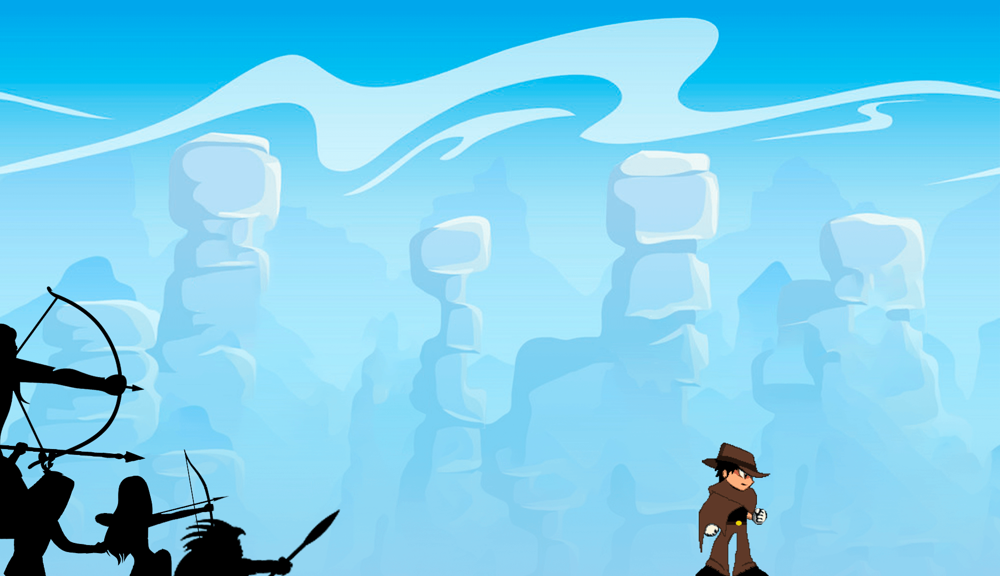

# GameDev 

 Projeto de desenvolvimento de um jogo em JavaScript através da biblioteca P5.js, durante o mini curso gratuito da Alura Cursos Online(#GameDev)

  

# História
O jogo se passa no velho oeste dos EUA, onde ainda havia conflitos entre cowboys e índios. Nosso herói retornava de uma viagem quando foi surpreso por alguns nativos que se sentiram ameaçados com a presença dele. Nosso herói consegue fugir no primeiro momento, mas tem vários desafios nesse caminho.

  

  
# Personagem
O personagem principal do jogo, ainda sem um nome, teve sua movimentação baseada no "X", de Megaman X. Já sua aparecia foi inspiradas em cowboys do velho oeste, assim como os de Sunset Riders de SNES.

  

# Inimigos
Os inimigos foram reaproveitados de vários antigos. A maioria só foi recolorido e por isso esse jogo não pode, de maneira alguma, ser monetizado.

  
  
  
  
  
  
  

> # Inimigos não aproveitados
> Estes inimigos foram animados e recoloridos, mas não foram utilizados no estado atual do jogo.

  
  
  
  
  

  
  
  
  
  

